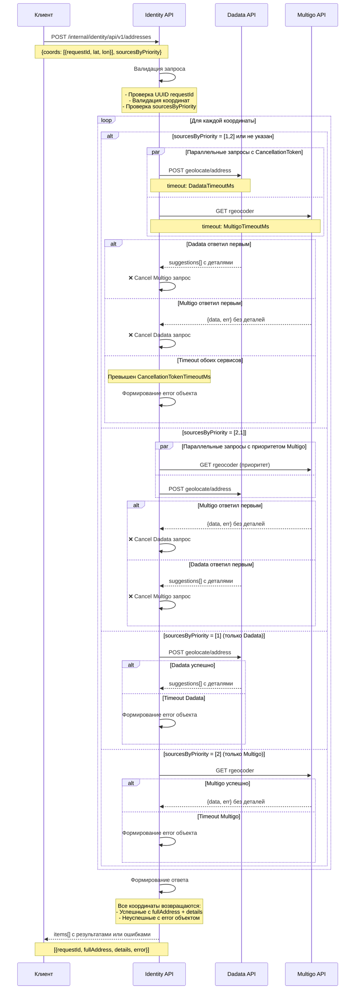

# POST Получение адресов по координатам

## Цель

Массовое преобразование географических координат в структурированные адреса через интеграцию с Dadata и Multigo API с поддержкой приоритетности источников.

## EndPoint

```
POST /internal/identity/api/v1/addresses
```

## Запрос

### Body Parameters

| Параметр | Тип | Обязательность | Описание | Ограничения |
|----------|-----|----------------|----------|-------------|
| coords | array | Обязательно | Массив объектов координат | Максимум: см. [Конфигурация](#конфигурация) `MaxCoordinatesPerRequest` |
| coords[].requestId | text | Обязательно | Уникальный идентификатор запроса | UUID4 формат |
| coords[].longitude | double | Обязательно | Долгота в десятичных градусах | -180.0 до 180.0 |
| coords[].latitude | double | Обязательно | Широта в десятичных градусах | -90.0 до 90.0 |
| sourcesByPriority | array | Опционально | Приоритет источников данных | [1], [2], [1,2], [2,1] |

### SourcesByPriority Enum

| Значение | Описание |
|----------|----------|
| 1 | Dadata API |
| 2 | Multigo API |

### Пример запроса

```json
{
  "coords": [
    {
      "requestId": "550e8400-e29b-41d4-a716-446655440001",
      "longitude": 37.6176,
      "latitude": 55.7558
    },
    {
      "requestId": "550e8400-e29b-41d4-a716-446655440002", 
      "longitude": 30.3351,
      "latitude": 59.9311
    }
  ],
  "sourcesByPriority": [1, 2]
}
```

## Ответ

### Response Body

| Параметр | Тип | Описание |
|----------|-----|----------|
| items | array | Массив объектов адресов |
| items[].requestId | text | Идентификатор из запроса |
| items[].longitude | double | Долгота исходной координаты |
| items[].latitude | double | Широта исходной координаты |
| items[].fullAddress | text | Полный адрес |
| items[].details | object | Детализированные компоненты (null для Multigo) |
| items[].error | object | Информация об ошибке (если внешние сервисы недоступны) |
| items[].error.code | text | Код ошибки |
| items[].error.message | text | Описание ошибки |
| items[].details.countryName | text | Название страны |
| items[].details.postalCode | text | Почтовый индекс |
| items[].details.regionType | text | Тип региона |
| items[].details.regionName | text | Название региона |
| items[].details.areaType | text | Тип района |
| items[].details.areaName | text | Название района |
| items[].details.subAreaType | text | Тип подрайона/округа |
| items[].details.subAreaName | text | Название подрайона/округа |
| items[].details.cityName | text | Название города |
| items[].details.cityDistrictType | text | Тип городского района |
| items[].details.cityDistrictName | text | Название городского района |
| items[].details.settlementType | text | Тип населенного пункта |
| items[].details.settlementName | text | Название населенного пункта |
| items[].details.streetType | text | Тип улицы |
| items[].details.streetName | text | Название улицы |
| items[].details.houseType | text | Тип дома |
| items[].details.houseNumber | text | Номер дома |
| items[].details.blockType | text | Тип корпуса/блока |
| items[].details.blockNumber | text | Номер корпуса/блока |

### Примеры ответов

#### Успешный ответ от Dadata
```json
{
  "items": [
    {
      "requestId": "550e8400-e29b-41d4-a716-446655440001",
      "longitude": 37.65372,
      "latitude": 55.878315,
      "fullAddress": "г Москва, ул Сухонская, д 11",
      "error": null,
      "details": {
        "countryName": "Россия",
        "postalCode": "127642",
        "regionType": "г",
        "regionName": "Москва",
        "areaType": null,
        "areaName": null,
        "subAreaType": "Северо-восточный",
        "subAreaName": "Северо-восточный",
        "cityName": "Москва",
        "cityDistrictType": null,
        "cityDistrictName": null,
        "settlementType": null,
        "settlementName": null,
        "streetType": "ул",
        "streetName": "Сухонская",
        "houseType": "д",
        "houseNumber": "11",
        "blockType": null,
        "blockNumber": null
      }
    }
  ]
}
```

#### Ответ от Multigo (details = null)
```json
{
  "items": [
    {
      "requestId": "550e8400-e29b-41d4-a716-446655440001",
      "longitude": 37.537543039738594,
      "latitude": 55.632409499999994,
      "fullAddress": "улица Островитянова, 43А, Москва, Москва, Россия",
      "details": null,
      "error": null
    }
  ]
}
```

#### Ответ с ошибкой недоступности сервисов
```json
{
  "items": [
    {
      "requestId": "550e8400-e29b-41d4-a716-446655440001",
      "longitude": 37.6176,
      "latitude": 55.7558,
      "fullAddress": null,
      "details": null,
      "error": {
        "code": "EXTERNAL_SERVICE_UNAVAILABLE",
        "message": "Внешние сервисы недоступны"
      }
    }
  ]
}
```


## Коды ошибок

| Код | Сообщение | Описание |
|-----|-----------|----------|
| 400 | "Выберите существующее значение источника запроса" | Некорректное значение в sourcesByPriority |
| 400 | "Источники запроса не должны повторяться" | Дублирование значений в sourcesByPriority |
| 400 | "Неверный формат запроса" | Ошибка валидации JSON или обязательных полей |
| 400 | "Превышено максимальное количество координат" | Превышение лимита из [Конфигурация](#конфигурация) `MaxCoordinatesPerRequest` |
| 500 | "Внутренняя ошибка сервера" | Ошибка при обработке запроса |

# Конфигурация

> **📋 Раздел ограничений и таймаутов API**  
> Все численные параметры системы определены в данной конфигурации

| Параметр | Значение | Описание |
|----------|----------|----------|
| **MaxCoordinatesPerRequest** | 100 | Максимальное количество пар координат в одном запросе |
| **RateLimitPerSecond** | 30 | Лимит запросов в секунду к внешним сервисам |
| **DadataTimeoutMs** | 5000 | Таймаут запроса к Dadata API (миллисекунды) |
| **MultigoTimeoutMs** | 5000 | Таймаут запроса к Multigo API (миллисекунды) |
| **CancellationTokenTimeoutMs** | 10000 | Общий таймаут обработки запроса с CancellationToken |

---

## Логика работы

### Sequence диаграмма



### Приоритетность ответов

#### sourcesByPriority не указан (по умолчанию [1,2])
- Параллельно запрашиваем Dadata + Multigo с CancellationToken
- Если Dadata ответил первым: отменяем Multigo, возвращаем Dadata (fullAddress + details)
- Если Multigo ответил первым: отменяем Dadata, возвращаем Multigo (fullAddress, details=null)
- Если оба не ответили в течение таймаута: возвращаем координату с объектом error

#### sourcesByPriority = [1,2]
- Параллельно запрашиваем Dadata + Multigo с CancellationToken
- Если Dadata ответил первым: отменяем Multigo, возвращаем Dadata
- Если Multigo ответил первым: отменяем Dadata, возвращаем Multigo
- Если оба не ответили в течение таймаута: возвращаем координату с объектом error

#### sourcesByPriority = [2,1]
- Параллельно запрашиваем Multigo + Dadata с CancellationToken
- Если Multigo ответил первым: отменяем Dadata, возвращаем Multigo (fullAddress, details=null)
- Если Dadata ответил первым: отменяем Multigo, возвращаем Dadata
- Если оба не ответили в течение таймаута: возвращаем координату с объектом error

#### sourcesByPriority = [1]
- Запрашиваем только Dadata с CancellationToken (таймаут согласно [Конфигурация](#конфигурация) `DadataTimeoutMs`)
- Если ответил: возвращаем Dadata
- Если не ответил в течение таймаута: возвращаем координату с объектом error

#### sourcesByPriority = [2]
- Запрашиваем только Multigo с CancellationToken (таймаут согласно [Конфигурация](#конфигурация) `MultigoTimeoutMs`)
- Если ответил: возвращаем Multigo (fullAddress, details=null)
- Если не ответил в течение таймаута: возвращаем координату с объектом error

## Интеграции с внешними API

> **Внимание**: Dadata и Multigo - внешние сервисы с фиксированными контрактами. Наш микросервис только использует их API согласно их документации.

### Dadata API (внешний сервис)

#### Конфигурация стороннего API
- URL: `https://suggestions.dadata.ru/suggestions/api/4_1/rs/geolocate/address`
- Method: POST
- Body: JSON с параметрами lat, lon
- Timeout: см. [Конфигурация](#конфигурация) `DadataTimeoutMs`
- Ограничения: максимальная частота запросов — см. [Конфигурация](#конфигурация) `RateLimitPerSecond`

#### Пример запроса к Dadata
```
POST https://suggestions.dadata.ru/suggestions/api/4_1/rs/geolocate/address

{
  "lat": 55.878,
  "lon": 37.653
}
```

#### Ответ от Dadata (по их контракту)
```json
{
  "suggestions": [
    {
      "value": "г Москва, ул Сухонская, д 11",
      "unrestricted_value": "127642, г Москва, р-н Северное Медведково, ул Сухонская, д 11",
      "data": {
        "postal_code": "127642",
        "country": "Россия",
        "country_iso_code": "RU",
        "federal_district": "Центральный",
        "region_fias_id": "0c5b2444-70a0-4932-980c-b4dc0d3f02b5",
        "region_kladr_id": "7700000000000",
        "region_iso_code": "RU-MOW",
        "region_with_type": "г Москва",
        "region_type": "г",
        "region_type_full": "город",
        "region": "Москва",
        "area_fias_id": null,
        "area_kladr_id": null,
        "area_with_type": null,
        "area_type": null,
        "area_type_full": null,
        "area": null,
        "city_fias_id": "0c5b2444-70a0-4932-980c-b4dc0d3f02b5",
        "city_kladr_id": "7700000000000",
        "city_with_type": "г Москва",
        "city_type": "г",
        "city_type_full": "город",
        "city": "Москва",
        "city_area": "Северо-восточный",
        "city_district_fias_id": null,
        "city_district_kladr_id": null,
        "city_district_with_type": null,
        "city_district_type": null,
        "city_district_type_full": null,
        "city_district": null,
        "settlement_fias_id": null,
        "settlement_kladr_id": null,
        "settlement_with_type": null,
        "settlement_type": null,
        "settlement_type_full": null,
        "settlement": null,
        "street_fias_id": "95dbf7fb-0dd4-4a04-8100-4f6c847564b5",
        "street_kladr_id": "77000000000283600",
        "street_with_type": "ул Сухонская",
        "street_type": "ул",
        "street_type_full": "улица",
        "street": "Сухонская",
        "stead_fias_id": null,
        "stead_cadnum": null,
        "stead_type": null,
        "stead_type_full": null,
        "stead": null,
        "house_fias_id": "5ee84ac0-eb9a-4b42-b814-2f5f7c27c255",
        "house_kladr_id": "7700000000028360004",
        "house_cadnum": "77:02:0004008:1017",
        "house_flat_count": "105",
        "house_type": "д",
        "house_type_full": "дом",
        "house": "11",
        "block_type": null,
        "block_type_full": null,
        "block": null,
        "entrance": null,
        "floor": null,
        "flat_fias_id": null,
        "flat_cadnum": null,
        "flat_type": null,
        "flat_type_full": null,
        "flat": null,
        "flat_area": null,
        "square_meter_price": "248273",
        "flat_price": null,
        "room_fias_id": null,
        "room_cadnum": null,
        "room_type": null,
        "room_type_full": null,
        "room": null,
        "postal_box": null,
        "fias_id": "5ee84ac0-eb9a-4b42-b814-2f5f7c27c255",
        "fias_code": null,
        "fias_level": "8",
        "fias_actuality_state": "0",
        "kladr_id": "7700000000028360004",
        "geoname_id": "524901",
        "capital_marker": "0",
        "okato": "45280583000",
        "oktmo": "45362000",
        "tax_office": "7715",
        "tax_office_legal": "7715",
        "timezone": "UTC+3",
        "geo_lat": "55.878315",
        "geo_lon": "37.65372",
        "beltway_hit": "IN_MKAD",
        "beltway_distance": null,
        "metro": null,
        "divisions": null,
        "qc_geo": "0",
        "qc_complete": null,
        "qc_house": null,
        "history_values": null,
        "unparsed_parts": null,
        "source": null,
        "qc": null
      }
    }
  ]
}
```

#### Преобразование ответа Dadata в наш формат
| Поле из ответа Dadata | Наше поле API | Описание |
|----------------------|---------------|----------|
| suggestions[0].value | fullAddress | Полный адрес как есть |
| data.country | details.countryName | Страна |
| data.postal_code | details.postalCode | Почтовый индекс |
| data.region_type | details.regionType | Тип региона |
| data.region | details.regionName | Название региона |
| data.area_type | details.areaType | Тип района (может быть null) |
| data.area | details.areaName | Название района (может быть null) |
| data.city_area | details.subAreaType | Административный округ города |
| data.city_area | details.subAreaName | Название округа города |
| data.city | details.cityName | Город |
| data.city_district_type | details.cityDistrictType | Тип городского района (может быть null) |
| data.city_district | details.cityDistrictName | Название городского района (может быть null) |
| data.settlement_type | details.settlementType | Тип населенного пункта (может быть null) |
| data.settlement | details.settlementName | Название населенного пункта (может быть null) |
| data.street_type | details.streetType | Тип улицы |
| data.street | details.streetName | Название улицы |
| data.house_type | details.houseType | Тип дома |
| data.house | details.houseNumber | Номер дома |
| data.block_type | details.blockType | Тип корпуса/блока (может быть null) |
| data.block | details.blockNumber | Номер корпуса/блока (может быть null) |

### Multigo API (внешний сервис)

#### Конфигурация стороннего API
- URL: `https://api7.multigo.ru/3/service/rgeocoder`
- Method: GET
- Parameters: `key`, `lat`, `lng`
- API Key: **СКРЫТ** (берется из конфигурации)
- Timeout: см. [Конфигурация](#конфигурация) `MultigoTimeoutMs`
- Ограничения: отсутствуют

#### Наш запрос к Multigo
```
GET https://api7.multigo.ru/3/service/rgeocoder?key={API_KEY}&lat=55.63242&lng=37.537269
```

> **Внимание**: При некорректном формате параметров возможна ошибка `{"err":2002,"errmsg":"Param [lng] is not float!"}`. Требуется валидация формата координат.

#### Ответ от Multigo (по их контракту)

**Успешный ответ:**
```json
{
  "data": {
    "type": "p",
    "ll": [ 
      55.632409499999994,  // lat
      37.537543039738594   // lon
    ],
    "address": "улица Островитянова, 43А, Москва, Москва, Россия"
  },
  "err": 0
}
```

**Ответ с ошибкой параметра:**
```json
{
  "err": 2002,
  "errmsg": "Param [lng] is not float!"
}
```

#### Преобразование ответа Multigo в наш формат
- Поле `data.address` из их ответа → наше поле `fullAddress`
- Наше поле `details` устанавливается в `null` (т.к. Multigo не предоставляет структурированные данные)
- Координаты `data.ll[0]` (lat), `data.ll[1]` (lng) - игнорируем

## Обработка частичных ошибок

### Пачковая обработка координат

**Принцип работы**: API принимает массив координат, но отправляет запросы к внешним сервисам (Dadata и Multigo) для каждой пары координат индивидуально. Это означает, что из 100 запросов часть может быть успешной, а часть - неуспешной.

### Стратегии обработки частичных ошибок

#### Стратегия обработки: Возврат данных с ошибками
При недоступности внешних сервисов API возвращает все координаты из запроса:
- Успешные запросы: содержат fullAddress и details (или null для Multigo)
- Неуспешные запросы: содержат error объект с описанием проблемы

**Преимущества:**
- Пользователь знает о статусе каждой координаты из запроса
- Возможность различать разные типы ошибок
- Нет необходимости сравнивать исходный запрос с ответом для выявления пропущенных координат

**Пример:** Из 100 координат Dadata ответил на 80, Multigo на 15 дополнительных, 5 недоступны
```json
{
  "items": [
    // 80 объектов с данными от Dadata (fullAddress + details)
    // 15 объектов с данными от Multigo (fullAddress, details=null)  
    // 5 объектов с error информацией
  ]
}
```

### Примеры сценариев

#### Сценарий 1: Частичная недоступность внешних сервисов 
**Запрос:**
```json
{
  "coords": [
    {"requestId": "req-001", "longitude": 37.6176, "latitude": 55.7558},
    {"requestId": "req-002", "longitude": 30.3351, "latitude": 59.9311}, 
    {"requestId": "req-003", "longitude": 39.7015, "latitude": 47.2313}
  ],
  "sourcesByPriority": [1, 2]
}
```

**Ответ:**
```json
{
  "items": [
    {
      "requestId": "req-001",
      "longitude": 37.6176,
      "latitude": 55.7558,
      "fullAddress": "г Москва, Красная пл, д 1",
      "details": { /* данные от Dadata */ },
      "error": null
    },
    {
      "requestId": "req-002", 
      "longitude": 30.3351,
      "latitude": 59.9311,
      "fullAddress": "Санкт-Петербург, ул Невский проспект, 1",
      "details": null,
      "error": null
    },
    {
      "requestId": "req-003",
      "longitude": 39.7015,
      "latitude": 47.2313,
      "fullAddress": null,
      "details": null,
      "error": {
        "code": "EXTERNAL_SERVICE_UNAVAILABLE",
        "message": "Внешние сервисы недоступны"
      }
    }
  ]
}
```

#### Сценарий 2: Полная недоступность внешних сервисов
**Ответ:**
```json
{
  "items": [
    {
      "requestId": "req-001",
      "longitude": 37.6176,
      "latitude": 55.7558,
      "fullAddress": null,
      "details": null,
      "error": {
        "code": "EXTERNAL_SERVICE_UNAVAILABLE",
        "message": "Внешние сервисы недоступны"
      }
    }
  ]
}
```

#### Сценарий 3: Timeout внешних сервисов с CancellationToken
При превышении timeout (согласно [Конфигурация](#конфигурация)):
- Успешные ответы включаются в результат с данными
- Timeout запросы включаются в результат с error объектом
- Общее время ответа API ограничено согласно [Конфигурация](#конфигурация) `CancellationTokenTimeoutMs`
- При использовании 2 источников: если первый ответил, второй отменяется через CancellationToken


## Описание логики работы

Микросервис реализует паттерн параллельных запросов с приоритезацией источников и CancellationToken:

1. **Валидация входных данных**: проверка UUID4 формата requestId, валидация координат, проверка массива sourcesByPriority, ограничение количества координат (согласно [Конфигурация](#конфигурация) `MaxCoordinatesPerRequest`)
2. **Параллельное выполнение с CancellationToken**: одновременные HTTP-запросы к внешним API Dadata и Multigo с таймаутами
3. **Отмена запросов**: при получении ответа от первого источника отмена запроса ко второму источнику через CancellationToken
4. **Обработка ошибок**: возврат всех координат из запроса, включая error объекты для недоступных сервисов
5. **Преобразование данных**: маппинг структурированных данных от Dadata в унифицированный формат API


## Критерии приемки

### Основные требования
- [ ] API принимает массив координат с requestId для каждой пары (ограничение согласно [Конфигурация](#конфигурация) `MaxCoordinatesPerRequest`)
- [ ] Параллельные запросы к источникам согласно sourcesByPriority с CancellationToken
- [ ] Отмена второго запроса при получении ответа от первого источника
- [ ] Возврат всех координат из запроса, включая error объекты для недоступных сервисов
- [ ] Возврат requestId в каждом элементе ответа

### Валидация
- [ ] Проверка существования значений в sourcesByPriority (только 1,2)
- [ ] Ошибка 400 при дублировании значений в sourcesByPriority
- [ ] Ошибка 400 при некорректном формате requestId (не UUID4)
- [ ] Ошибка 400 при превышении максимального количества координат (согласно [Конфигурация](#конфигурация) `MaxCoordinatesPerRequest`)
- [ ] Валидация обязательных полей: coords, requestId, longitude, latitude

### Интеграции с внешними сервисами
- [ ] Корректный запрос к внешнему Dadata API с таймаутом (согласно [Конфигурация](#конфигурация) `DadataTimeoutMs`)
- [ ] Корректный запрос к внешнему Multigo API с таймаутом (согласно [Конфигурация](#конфигурация) `MultigoTimeoutMs`)
- [ ] Валидация формата координат для избежания ошибки "Param [lng] is not float!" от Multigo
- [ ] Обработка ошибок внешних API (err != 0 от Multigo, пустой массив от Dadata)
- [ ] Преобразование ответов внешних API в наш формат
- [ ] Использование CancellationToken для отмены запросов

### Особые случаи обработки
- [ ] При timeout внешних сервисов возврат координаты с error объектом
- [ ] При sourcesByPriority = [1] обращение только к внешнему Dadata с CancellationToken
- [ ] При sourcesByPriority = [2] обращение только к внешнему Multigo с CancellationToken
- [ ] При отсутствии sourcesByPriority параллельные запросы к обоим внешним сервисам [1,2]
- [ ] Общий таймаут обработки запроса (согласно [Конфигурация](#конфигурация) `CancellationTokenTimeoutMs`)


### Связанные документы

- [Логика микросервиса Identity](../logic.md)
- [Продуктовая документация Геокодер](../../../products/personal-account/modules/geocoding/geocoding.md)
- [Обратное геокодирование](../../../products/personal-account/modules/geocoding/features/reverse-geocoding.md)

---

## Метаданные задачи

**ID:** post-get-addresses-by-coordinates  
**Название:** POST Получение адресов по координатам  
**Описание:** API для массового преобразования географических координат в структурированные почтовые адреса через Dadata и Multigo API  
**Дата:** 2025-06-04 15:45:00  
**Версия:** v1.0  
**Статус:** draft  
**Feature ID:** PC-GEO-RG-001  
**Тип:** api  
**Автор:** AI Analyst  

**Критерии приемки:**
- Метод принимает массив координат с RequestId для каждой пары (ограничение согласно [Конфигурация](#конфигурация) `MaxCoordinatesPerRequest`)
- Запрашивает Dadata и Multigo API согласно SourcesByPriority с CancellationToken
- Отменяет второй запрос при получении ответа от первого источника
- Возвращает все координаты из запроса, включая error объекты при недоступности сервисов
- Поддерживает таймауты согласно [Конфигурация](#конфигурация): `DadataTimeoutMs`, `MultigoTimeoutMs`, `CancellationTokenTimeoutMs` 